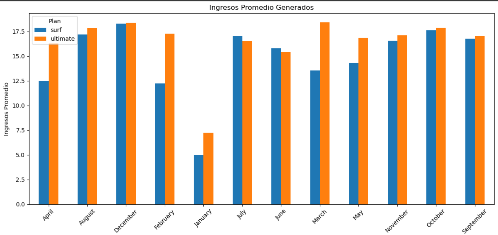
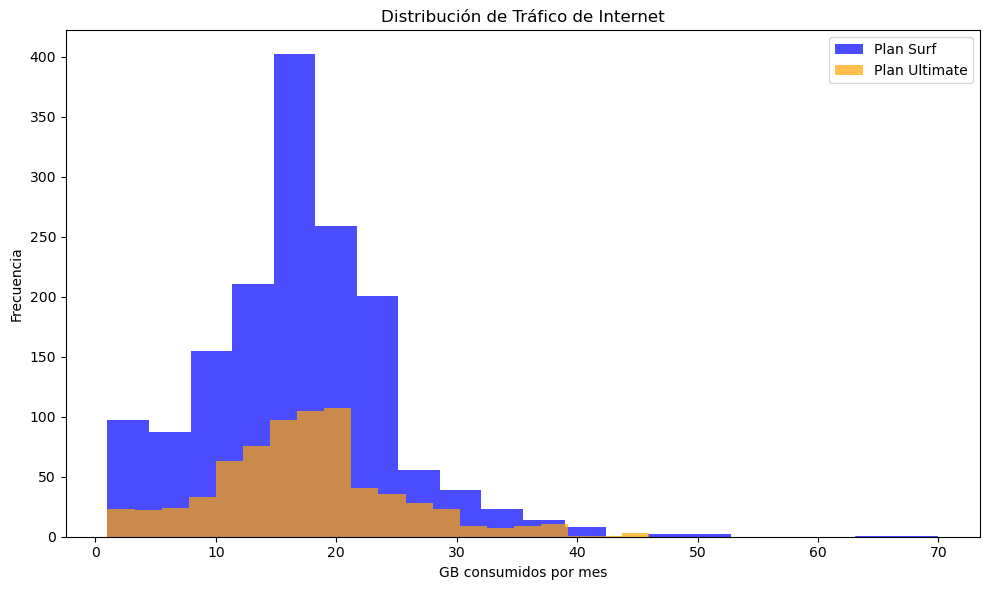

<div align="center">

# 📊 Análisis de Rentabilidad de Planes Móviles

### Identificando el plan más rentable mediante análisis de datos


</div>

---

## 📌 Descripción del Proyecto

La empresa de telecomunicaciones **Megaline** requiere determinar cuál de sus dos planes prepago genera una mayor rentabilidad:

📱 **Surf**  
📱 **Ultimate**

Para resolver esta necesidad, se realizó un proceso completo de análisis de datos utilizando información histórica de clientes, llamadas, mensajes, navegación y consumo mensual.

El objetivo principal fue identificar patrones de comportamiento y comprender qué plan produce mayores ingresos reales, considerando no solo la tarifa mensual, sino también los ingresos adicionales derivados de excedentes.

---

## 🎯 Objetivo del negocio

Determinar cuál de los planes móviles genera mayores ingresos para ayudar al departamento comercial a:

✔ Optimizar campañas publicitarias  
✔ Entender hábitos de consumo  
✔ Mejorar estrategias de retención  
✔ Incrementar rentabilidad

---

## 🧠 Preguntas de análisis

Durante el proyecto se buscaron respuestas a preguntas clave:

- ¿Los usuarios de distintos planes presentan comportamientos diferentes?
- ¿Qué plan genera mayores ingresos?
- ¿Existen patrones estacionales de consumo?
- ¿Los pagos por excedentes impactan la rentabilidad?
- ¿Las diferencias entre ingresos son estadísticamente significativas?

---

## 📂 Dataset utilizado

El proyecto integra información proveniente de múltiples fuentes:

| Dataset | Descripción |
|----------|-------------|
| Users | Información de clientes |
| Calls | Historial de llamadas |
| Messages | Registro de SMS |
| Internet | Consumo de datos móviles |
| Plans | Información de planes |

---

## ⚙️ Proceso realizado

### 1️⃣ Carga y exploración de datos

- Revisión de estructura
- Validación de tipos de datos
- Detección de inconsistencias

---

### 2️⃣ Limpieza y transformación

✔ Conversión de fechas  
✔ Corrección de tipos de datos  
✔ Transformación MB → GB  
✔ Creación de variables derivadas  
✔ Consolidación de tablas

---

### 3️⃣ Análisis exploratorio (EDA)

Se analizaron:

📞 Duración de llamadas

💬 Uso de SMS

🌐 Consumo de internet

📅 Comportamiento mensual

💵 Ingresos por usuario

---

### 4️⃣ Estadística y pruebas de hipótesis

Se aplicaron pruebas estadísticas para validar:

- Diferencias entre ingresos promedio
- Variabilidad entre planes
- Comparación entre regiones

Herramientas utilizadas:

```python
scipy.stats
ttest_ind()
```

---

## 📈 Hallazgos principales

### 📞 Consumo de llamadas

Los usuarios de ambos planes presentaron comportamientos muy similares:

- Surf ≈ 436 minutos promedio
- Ultimate ≈ 434 minutos promedio

Lo anterior indica que el consumo telefónico no representa una diferencia significativa.

---

### 🌐 Uso de internet

Se encontró un hallazgo especialmente importante:

Los usuarios del plan **Surf** excedían con mayor frecuencia los límites de navegación.

Esto generó ingresos adicionales mediante cobros por excedentes.

---

### 📅 Estacionalidad identificada

El consumo aumentó durante:

🎄 Diciembre

Posiblemente asociado a:

- vacaciones
- reuniones familiares
- actividades sociales

---

## 📊 Conclusiones

Después del análisis se identificaron hallazgos relevantes:

### ✅ Los hábitos de consumo son similares

Aunque los planes poseen beneficios y precios distintos, los usuarios presentan patrones de uso muy parecidos.

---

### ✅ El verdadero diferenciador fueron los excedentes

El plan **Surf** mostró una tendencia importante:

Los clientes estaban dispuestos a pagar cargos adicionales para continuar navegando.

Esto provocó que el plan generara ingresos significativamente superiores a los esperados inicialmente.

---

### ✅ La rentabilidad no depende únicamente del precio del plan

El estudio evidenció que los ingresos reales dependen fuertemente de:

- comportamiento del usuario
- excedentes
- patrones de uso

---

### 🚀 Conclusión final

Los resultados sugieren que el plan **Surf** posee una rentabilidad especialmente alta debido al comportamiento de consumo de sus usuarios y a los ingresos adicionales derivados de excedentes.

Esto demuestra la importancia del análisis de datos para comprender el verdadero valor de un producto más allá de su precio base.

---

## 🛠 Tecnologías utilizadas

| Herramienta | Uso |
|---|---|
| Python | Análisis |
| Pandas | Manipulación |
| NumPy | Procesamiento |
| Matplotlib | Visualización |
| Seaborn | EDA |
| SciPy | Estadística |
| Jupyter Notebook | Desarrollo |

---

## 📷 Vista del proyecto

Puedes agregar aquí capturas:

```md

<div align="center">

<h3>📊 Ingresos promedio por plan</h3>


<h3>🌐 Distribución de tráfico de internet</h3>


</div>

```

---

## 👨‍💻 Autor

**Carlos Guerrero**

Administrador de Negocios Internacionales → Data Analyst

📊 Python | SQL | Visualización | Estadística | Storytelling con datos

[](https://www.linkedin.com/in/carlosguerrero9923)
